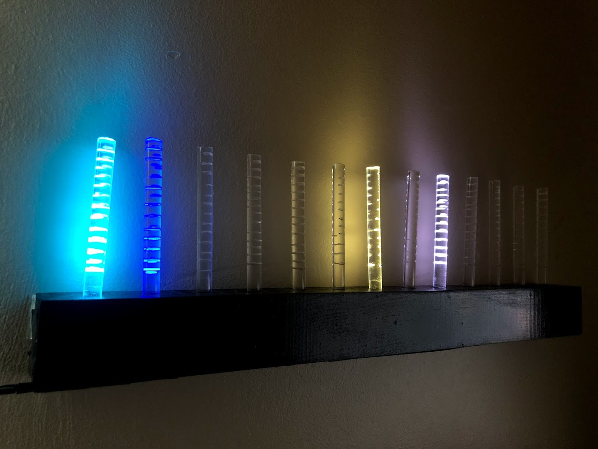
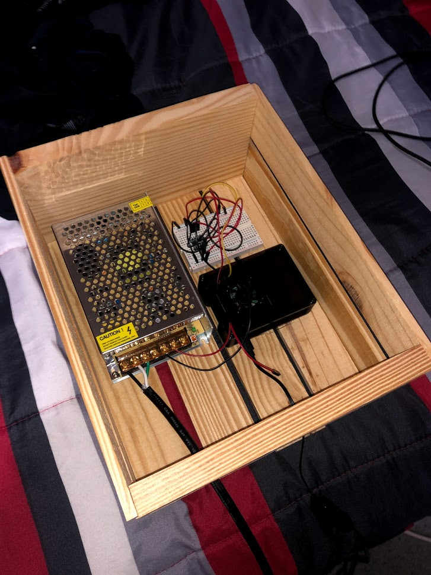
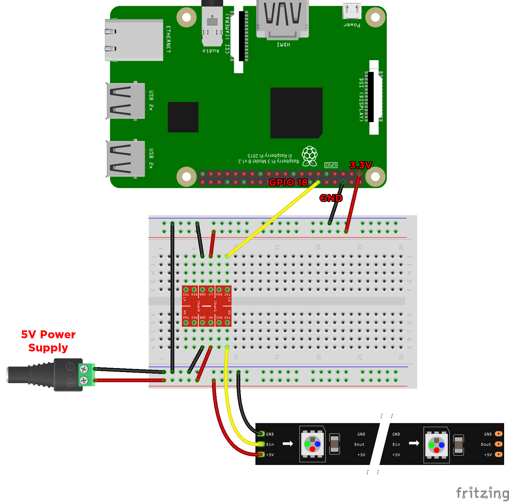

# Detection_Bot
Using a WS2812B RGB LED Strip and a Raspberry Pi this Discord bot is able to assign a color to a certain user within a server and lights up when said user join a certain voice channel. Overall lets you see which friends are currently in a voice channel talking. 

Confirmed working with [`discord.py`](https://discordpy.readthedocs.io/en/latest/index.html) 1.4.1

## Parts Used
  * [`Jumper Wires`](https://www.amazon.com/gp/product/B01LZF1ZSZ/ref=ppx_yo_dt_b_asin_title_o03_s00?ie=UTF8&psc=1)
  * [`Breadboard`](https://www.amazon.com/gp/product/B01LZF1ZSZ/ref=ppx_yo_dt_b_asin_title_o03_s00?ie=UTF8&psc=1)
  * [`Universal Switching Power Supply`](https://www.amazon.com/gp/product/B074YHN8D1/ref=ppx_yo_dt_b_asin_title_o03_s00?ie=UTF8&psc=1)
  * [`WS2812B RRGB LED Strip`](https://www.amazon.com/gp/product/B01LSF4Q00/ref=ppx_yo_dt_b_asin_title_o03_s00?ie=UTF8&psc=1)
  * [`Logic Level Converter`](https://www.amazon.com/gp/product/B07LG646VS/ref=ppx_yo_dt_b_asin_title_o02_s00?ie=UTF8&psc=1)
  * [`Raspberry Pi 3 Model B+`](https://www.amazon.com/ELEMENT-Element14-Raspberry-Pi-Motherboard/dp/B07P4LSDYV/ref=sr_1_3?crid=1PTI6L0WM4B18&dchild=1&keywords=raspberry+pi+3&qid=1597706886&s=electronics&sprefix=ras%2Celectronics%2C180&sr=1-3)
  * [`Solder`](https://www.amazon.com/gp/product/B084RZF23H/ref=ppx_yo_dt_b_asin_title_o03_s00?ie=UTF8&psc=1)
  *  Soldering Iron
  * [`Raspberry Pi 3 B+ Case w/Fan + Power Supply`](https://www.amazon.com/gp/product/B07GKXZH7X/ref=ppx_yo_dt_b_asin_title_o02_s00?ie=UTF8&psc=1)
  * Wooden Crate
  * [`Computer Monitor Power Cord`](https://www.amazon.com/gp/product/B072BYGKZZ/ref=ppx_od_dt_b_asin_title_s00?ie=UTF8&psc=1)
  
## Finished Product



This is how the device looks when it's in action, in the picture above there were three of my friends online, including me!




In the picture above, this is the enclosing I made for the system. Although theres most likely better options out there, it had holes for ventilation and everything fit well. All I had to do was drill two holes for the power cables. 

## Setting the Raspberry Pi Up

### Creating the directory and bot.py
First I created a directory to store my bot in. 

```
mkdir discord_bot
```

Then I went into that directory and created a .py file, which will be where we put all the code into the bot.

```
cd discord_bot
touch bot.py
nano bot.py
```
### Installing NeoPixel Library & Discord.py
For discord.py use the follow command
```
python3 -m pip install -U discord.py[voice]
```
For the NeoPixel Library use the follow command
```
sudo pip3 install rpi_ws281x adafruit-circuitpython-neopixel
```

### Making bot.py start on boot
My next step was to get the bot.py to launch on boot, this was of course going to be an enclosed system so I wouldn't be able to connect a keyboard to it everytime. Now, the way I did this was through editing the profile

```
sudo crontab -e
```
I then went to the bottom of the file and added the directory of bot.py

```
@reboot sudo python3 /home/pi/discord_bot/bot.py
```
I then edited the raspi-config

```
sudo raspi-config
```
I then went into Boot Options and chose B2 Console Autologin. However, after the reboot I went back to edit the config and chose Wait for Network at Boot as we need a internet connection to see who is online and in the certain voice channel. 

## Schematic

I used this schematic shown below, of course I'm sure theres multiple other ones you can use but this is just for reference.

Schematic above created by Michael from Coreelectronics and can be found [`here`](https://core-electronics.com.au/tutorials/ws2812-addressable-leds-raspberry-pi-quickstart-guide.html) full credit goes to him. 

# Help
If anyone is confused by anything or wants to ask me a question about the project please contact me at enrique-orozc@outlook.com. I will try my best to help and respond promptly.
